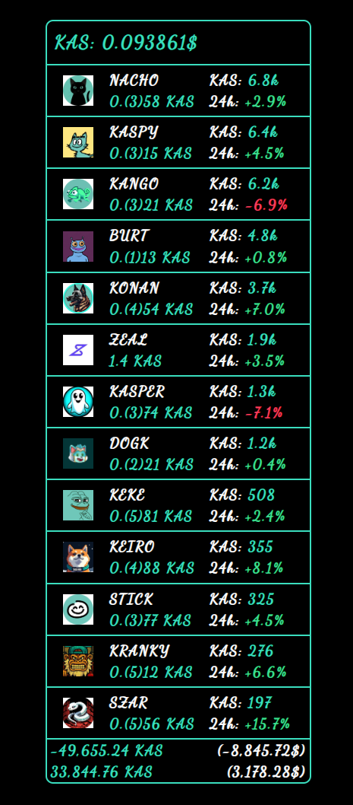

# 💸 Crpt – A Minimalist KAS Portfolio Tracker

[Live Demo →](https://pd-crpt.netlify.app/portfolio)

I've developed it to track my portfolio of $KAS and meme coin positions with style, speed, and precision. **Crpt** is a performance-focused Angular 20+ app built entirely on modern Angular tools: **Signals, Zoneless, httpResource, and Vitest**. No boilerplate, no noise — just crypto.

<p align="center">
  
</p>

---

## ✨ Features

- 🔄 **Real-time price fetching** for KAS and custom tokens
- 🧠 **Reactive state** with Angular Signals (no NgRx)
- 🧮 **Portfolio calculation engine**: KAS, USD, profit/loss
- 🧾 **Clean, expandable UI** for positions and operation history
- 🌘 **Dark-mode-ready SCSS theme** using variables and modular structure

---

## ⚙️ Tech Stack

| Category        | Technology                                  |
| --------------- | ------------------------------------------- |
| 🧠 Core         | Angular 20, Standalone Components, Zoneless |
| 🧵 Styling      | SCSS (BEM-style, modular, theme-based)      |
| ⚡ Reactivity   | Angular Signals, `httpResource`             |
| 🧪 Testing      | Vitest (replaces Karma/Jasmine) + Coverage  |
| 📐 Architecture | Typed interfaces, OnPush change detection   |

---

## 🧪 Unit Testing & Code Coverage

I've ditched Karma + Jasmine and moved to a modern setup using Vitest with Angular 20’s experimental support.

### Run all tests

```bash
npm run test
```

### Clean old reports, run coverage, and open result

```bash
npm run test:cc
```

---

## 🚀 Getting Started

### 1. Clone and install

```bash
git clone https://github.com/pdolecki/crpt.git
cd crpt
npm install
```

### 2. Run the app

```bash
npm start
```
